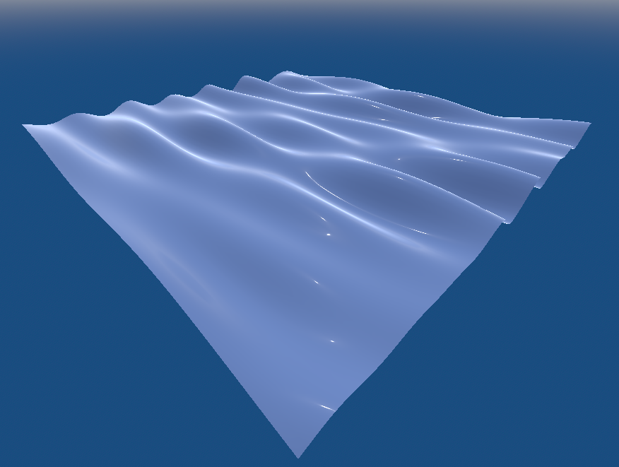
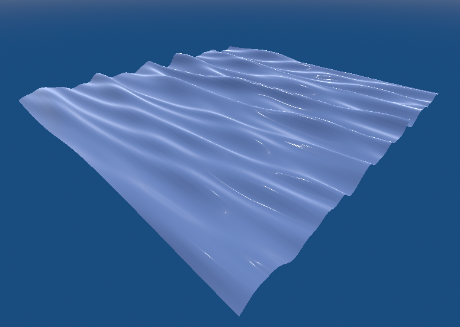
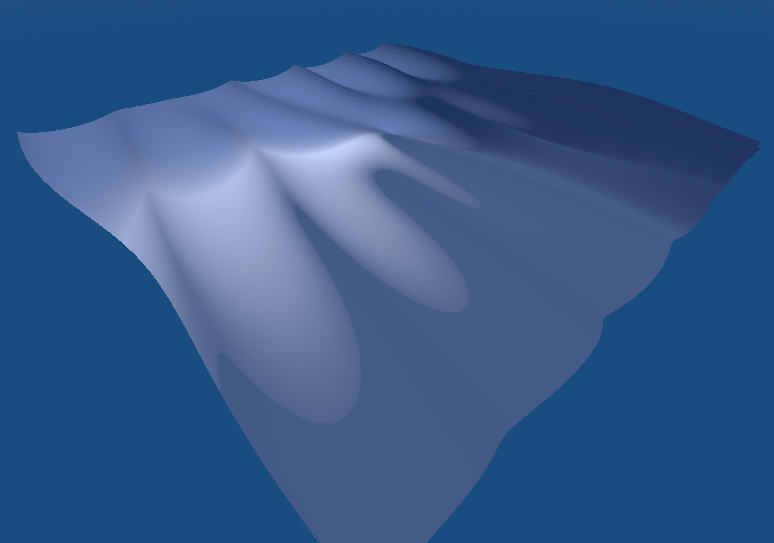
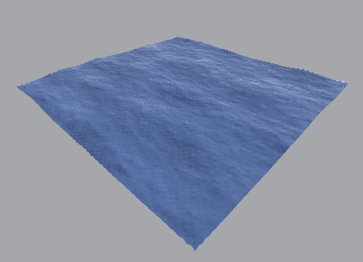

### Godot Water Simulations
This repository contains Godot implementations of Sum of Sines, Steep Sum of Sines, Gerstner waves and Tessendorf waves using TMA spectra modified by Horvath.

### Usage
1. [Download Godot version 4.2.x](https://godotengine.org/)
2. Clone the repository and open the project
3. Open a scene and play it with F6. Adjust parameters by clicking the root node.

The project contains addons for camera movement (wasd, mousewheel for speed control) and performance monitoring (F3).

Your GPU must support either the Forward+ or Mobile renderer.
